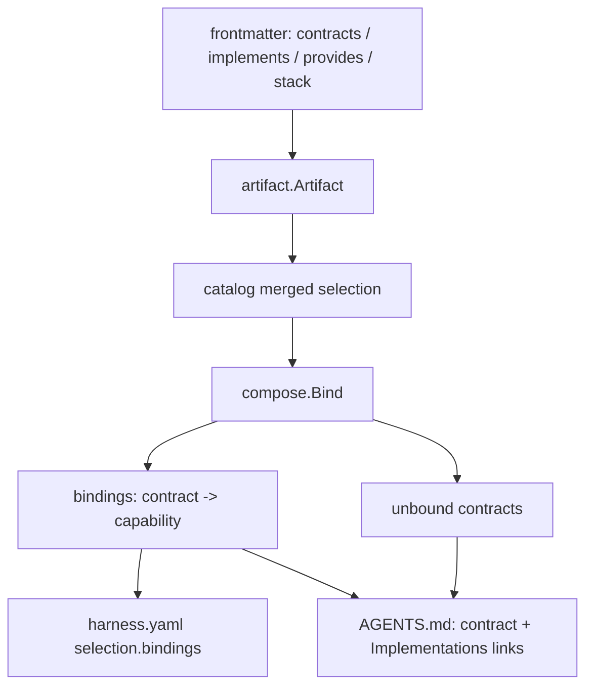

# Artifact Composition Design

**Spec**: `.agents/specs/features/artifact-composition/spec.md`
**Status**: Draft

---

## Architecture Overview

Composition is a derivation over the resolved catalog: abstract skills declare contracts, capabilities declare what they implement/provide, and a composer binds them. It lives entirely on the model side — frontmatter fields flow into the artifact, a `compose` package computes bindings, the manifest records them, and `AGENTS.md` rendering presents the contract with linked implementations. The interactive screen (P2) and stack filtering (P3) are layered on later and are the only parts that touch the TUI.



---

## Code Reuse Analysis

| Component | Location | How to Use |
| --------- | -------- | ---------- |
| `Frontmatter` parse/validate | `internal/artifact/frontmatter.go` | Add `contracts`/`implements`/`provides`/`stack`; validate abstract-xor-capability. |
| `artifact.Artifact` | `internal/artifact/artifact.go` | Carry the four new fields. |
| `LocalDirectory.read` | `internal/source/local.go` | Populate the new fields from frontmatter. |
| `RenderAgentsFile` + template | `internal/workspace/agentsmd.go`, `assets/templates` | Render compositions: contract + Implementations section. |
| `Manifest`/`Selection` | `internal/workspace/manifest.go` | `Selection.Bindings` for abstract skills. |
| `catalog` | `internal/catalog` | Source of the merged set the composer reads. |

---

## Components

### Composition model (frontmatter + artifact)

- **Abstract skill**: `contracts: [domain, command, query, persistence, inbound, naming]`.
- **Capability**: `implements: low-level-design`, `provides: [domain, command]`, `stack: typescript`.
- An artifact with `contracts` is abstract; with `implements` is a capability; declaring both is an error (an `Issue`).

### compose package

- **Purpose**: Derive bindings for the selected set.
- **Location**: `internal/compose/compose.go`
- **Interfaces**:
  - `type Composition struct { Abstract artifact.Identity; Bindings []Binding; Unbound []string }`
  - `type Binding struct { Contract string; Capability artifact.Identity; Shadowed []artifact.Identity }`
  - `func Bind(selected []artifact.Artifact) []Composition`
- **Behavior**: for each selected abstract, for each contract, choose the selected capability whose `implements` matches and whose `provides` includes the contract; on multiple, pick by precedence then name (the rest are `Shadowed`); contracts with no provider go to `Unbound`. Capabilities/abstracts that don't pair up are simply not part of any composition.

### AGENTS.md rendering

- **Location**: `internal/workspace/agentsmd.go`
- For each selected abstract skill, render its entry (the contract) followed by an **Implementations** block: one line per contract → linked capability entry document (relative/absolute per source, reusing `displayPath`). Unbound contracts render as `⚠ <contract>: no implementation selected`.

### Manifest bindings

- **Location**: `internal/workspace/manifest.go`
- `Selection.Bindings map[string]string` (contract → capability name), set for abstract-skill selections during `Apply` from the composition. Empty for ordinary artifacts.

---

## Data Models

### Frontmatter additions

```go
type Frontmatter struct {
    // ... existing ...
    Contracts  []string `yaml:"contracts,omitempty"`  // abstract: required contract ids
    Implements string   `yaml:"implements,omitempty"` // capability: the abstract it implements
    Provides   []string `yaml:"provides,omitempty"`   // capability: contract ids it fulfils
    Stack      string   `yaml:"stack,omitempty"`      // capability: stack label (typescript, go, php)
}
```

Other agents ignore unknown keys, so this stays agentskills-compatible.

### Selection addition (`harness.yaml`)

```go
type Selection struct {
    // ... existing kind/name/source/version/digest ...
    Bindings map[string]string `yaml:"bindings,omitempty"` // contract -> capability name (abstract skills only)
}
```

---

## Error Handling Strategy

| Scenario | Handling | User impact |
| -------- | -------- | ----------- |
| Artifact declares both `contracts` and `implements` | `Issue`, skipped | "must be either an abstract or a capability" |
| Capability `implements` an unselected/absent abstract | Treated as an ordinary skill | No composition; no error |
| `provides` a contract the abstract does not declare | Ignored (extra) | Optional note |
| Contract with no provider selected | `Unbound`; warning on save; flagged in AGENTS.md | "⚠ composition incomplete: <contract>" |
| Two providers for one contract | Bind by precedence+name; others shadowed | Reported like the existing override note |

---

## Tech Decisions

| Decision | Choice | Rationale |
| -------- | ------ | --------- |
| Where composition fields live | Frontmatter top-level keys | agentskills-compatible (ignored by others); first-class for harness. |
| Abstract vs capability | Mutually exclusive by `contracts` xor `implements` | Clear roles; matches interface-vs-trait mental model. |
| Binding identity | Bind by artifact identity; precedence resolves overrides | Local override "just works" via the existing N-source merge (no pinning). |
| Bindings derivation | Derived from the selected set, recorded in the manifest | The flat selection already expresses intent; the screen (P2) only makes it ergonomic. |
| Granularity | A capability may provide a subset of contracts | Enables trait-style mixing (core + persistence + inbound from different capabilities). |

---

## Phasing

- **P1 (this milestone, no TUI):** frontmatter model, `compose.Bind`, manifest bindings, AGENTS.md rendering, and the extracted `low-level-design` + `lld-typescript` artifacts.
- **P2 (after the in-flight TUI work is committed):** the interactive composition screen in `internal/tui`.
- **P3:** project stack declaration/detection and stack-filtered auto-binding.
