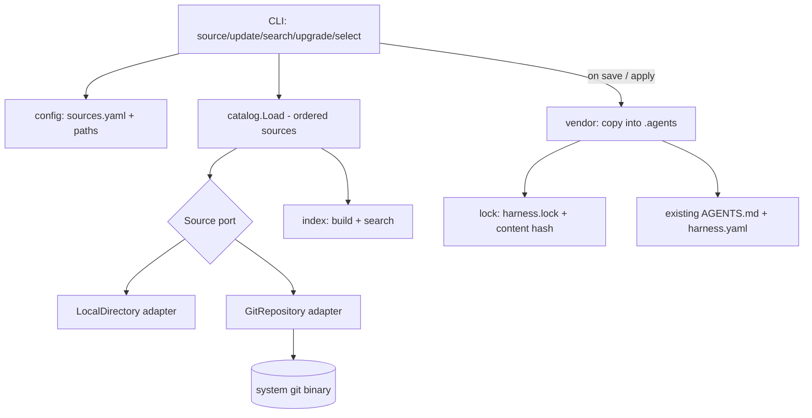

# Multi-Source Artifact Management Design

**Spec**: `.agents/specs/features/multi-source-artifacts/spec.md`
**Status**: Draft

---

## Architecture Overview

The two hardcoded locations become two adapters of a single `Source` port. The catalog merges an ordered list of sources by precedence. A git adapter shells out to the system `git`. Remote selections are vendored into the project and locked by content hash. A manifest index serves offline search.



Resolution is a two-step contract per the apt/krew pattern: **Resolve** returns lightweight manifests (cheap, for catalog/search); **Fetch** returns the artifact payload directory (only when vendoring).

---

## Code Reuse Analysis

### Existing Components to Leverage

| Component | Location | How to Use |
| --------- | -------- | ---------- |
| `artifact.Artifact`, `Kind`, `Identity`, `EntryFileFor` | `internal/artifact/artifact.go` | Reuse as-is; `Identity` extended with `Source` for global addressing. |
| `frontmatter.ParseDocument` / `Validate` | `internal/artifact/frontmatter.go` | Reuse unchanged for manifest extraction from any source. |
| Catalog scan/merge + `Issue` diagnostics | `internal/catalog/catalog.go` | The current `scanBase`/`merge` become the body of the `LocalDirectory` adapter; `merge` generalizes to N ordered sources. |
| `config` path helpers | `internal/config/paths.go` | Extend with `sources.yaml`, `sources/`, `index/`, `harness.lock`. |
| Manifest read/write (`harness.yaml`) | `internal/workspace/manifest.go` | Pattern to mirror for `sources.yaml` and `harness.lock` (yaml.v3). |
| On-demand `.agents` creation | `internal/workspace/writer.go` | Reuse; vendoring creates container dirs on demand the same way. |
| Issue surfacing in CLI | `internal/app/app.go` `printIssues` | Reuse for invalid artifacts from remote sources. |

### Integration Points

| System | Integration Method |
| ------ | ------------------ |
| Existing selection TUI | Items now carry a source label; rendering shows `<source>/<name>`. No TUI-engine change. |
| `workspace.Apply` (save) | On confirm, remote selections are vendored + locked before/with the existing `AGENTS.md` + `harness.yaml` write. |
| `catalog.Load(home, agentsDir)` | Replaced by `catalog.Load(sources ...source.Source)`; `app.loadCatalog` constructs the ordered source list. |

---

## Components

### Source port

- **Purpose**: One contract for "a place artifacts come from".
- **Location**: `internal/source/source.go`
- **Interfaces** (Go):
  - `type Source interface { Name() string; Resolve() ([]Manifest, []catalog.Issue, error); Fetch(id artifact.Identity) (Payload, error) }`
  - `type Manifest struct { Kind artifact.Kind; Name, Description, Source string; Ref string; Locator string; Metadata map[string]string }`
  - `type Payload struct { Directory string }` — absolute path to a directory laid out as `<ENTRY>.md` (+ optional subdirs), ready to copy.
- **Dependencies**: `artifact`, `catalog.Issue`.
- **Reuses**: `frontmatter` for parsing; `artifact` conventions.

### LocalDirectory adapter

- **Purpose**: Resolve artifacts from a base directory (home library or project `.agents/`).
- **Location**: `internal/source/local.go`
- **Interfaces**: `func NewLocalDirectory(name, base string) Source`.
- **Dependencies**: filesystem, `artifact`, `frontmatter`.
- **Reuses**: the existing `scanBase`/`readArtifact` logic moved here verbatim; `Fetch` returns the on-disk directory.

### GitRepository adapter

- **Purpose**: Resolve artifacts from a cloned git working copy; refresh via fetch.
- **Location**: `internal/source/git.go` (+ `internal/source/gitcli/` for the binary wrapper).
- **Interfaces**: `func NewGitRepository(name, url, ref, cloneDir string) Source`; internal `func Sync() error` (clone-or-pull).
- **Dependencies**: system `git` via `gitcli`; wraps a `LocalDirectory` over the clone for resolution.
- **Reuses**: `LocalDirectory` for scanning the checked-out tree (the clone IS the cache for git).
- **Concerns addressed (binding cross-platform rules, see STATE.md D5–D7)**:
  - `exec.LookPath("git")`; actionable error if absent (SRC-06).
  - `exec.Command("git", args...)` slice form only; no shell.
  - Always pass `-c core.autocrlf=false -c core.eol=lf`.
  - Set `GIT_TERMINAL_PROMPT=0` in the command env.
  - Clone into a temp dir, then `os.Rename` on success (partial-clone safety).

### Index

- **Purpose**: Persist resolved manifests for offline, token-free `search`.
- **Location**: `internal/index/index.go`
- **Interfaces**: `func Build(sources []source.Source) (Index, error)`; `func Load(path string) (Index, error)`; `func (Index) Search(query string) []source.Manifest`.
- **Dependencies**: `source`, yaml/json cache under `~/.harness/index/`.
- **Reuses**: `Manifest` from `source`; simple case-insensitive substring match over name+description (no embeddings in this milestone).

### Lock

- **Purpose**: Reproducible record of what was vendored.
- **Location**: `internal/lock/lock.go`
- **Interfaces**: `func Load(path string) (Lockfile, error)`; `func (Lockfile) Save(path string) error`; `func ContentHash(dir string) (string, error)`.
- **Dependencies**: filesystem, sha256, yaml.v3.
- **Reuses**: yaml pattern from `workspace.manifest`.
- **Concern addressed (SRC-04, SRC-07)**: `ContentHash` walks the directory in sorted order, normalizes `\r\n`→`\n` for text entries before hashing, and combines per-file hashes — stable across OSes.

### Vendor

- **Purpose**: Materialize a remote artifact into the project and lock it.
- **Location**: `internal/vendor/vendor.go`
- **Interfaces**: `func Vendor(payload source.Payload, kind artifact.Kind, name, projectRoot string) (lock.Entry, error)`.
- **Dependencies**: `source`, `lock`, `config`.
- **Reuses**: on-demand dir creation from `workspace.writer`.
- **Behavior**: copy directory tree (not symlink), compute content hash, return the lock entry; idempotent (re-vendor verifies hash, SRC-04 reproducibility).

### Catalog (refactor)

- **Purpose**: Merge ordered sources into the resolved set with precedence.
- **Location**: `internal/catalog/catalog.go` (modified)
- **Interfaces**: `func Load(sources ...source.Source) (Catalog, error)`; `Catalog.All()`, `Find`, `Issues()` unchanged.
- **Reuses**: existing `merge` generalized; precedence = source order (earlier wins), with `OverridesShared`-style flagging renamed conceptually to "overridden by higher-precedence source".

### CLI (additions)

- **Location**: `main.go` dispatch + `internal/app/app.go`
- **Commands**: `source add|list|remove`, `update`, `search`, `upgrade`; plus the existing default selection flow now vendors+locks on save.

---

## Data Models

### `sources.yaml` (`~/.harness/sources.yaml`)

```go
type SourcesConfig struct {
    Sources []SourceConfig `yaml:"sources"`
}
type SourceConfig struct {
    Name string `yaml:"name"`           // resolved id, used as namespace prefix
    Type string `yaml:"type"`           // "git" (future: "npm", "oci")
    URL  string `yaml:"url"`
    Ref  string `yaml:"ref,omitempty"`  // branch/tag; default "main"
}
```

Never stores secrets — credentials live in the user's git/ssh configuration.

### `harness.lock` (`<project>/.agents/harness.lock`)

```go
type Lockfile struct {
    Version   int     `yaml:"version"`
    Artifacts []Entry `yaml:"artifacts"`
}
type Entry struct {
    Kind        string `yaml:"kind"`
    Name        string `yaml:"name"`
    Source      string `yaml:"source"`        // source name; "" or "local" for project/home
    Commit      string `yaml:"commit,omitempty"`
    ContentHash string `yaml:"contentHash"`   // "sha256:..."
    Path        string `yaml:"path"`          // forward-slash, relative to .agents/
}
```

**Relationships**: `harness.yaml` (selections, already exists) says *what is active*; `harness.lock` says *exactly what was resolved*. One lock `Entry` per vendored remote artifact; local/home artifacts need no vendoring (referenced in place as today) but MAY appear in the lock for traceability.

---

## Error Handling Strategy

| Error Scenario | Handling | User Impact |
| -------------- | -------- | ----------- |
| `git` not on PATH | `exec.LookPath` fails → typed error | "git is required but was not found on your PATH. Install git and retry." |
| Private clone auth fails | git exits non-zero; capture stderr | Surface git's own message (e.g. permission denied); no harness-invented auth flow. |
| Source unreachable on `update` | Keep last indexed manifests; collect a warning | "Could not refresh <source> (offline?); using cached index." |
| Hash mismatch on apply/upgrade | Stop; do not overwrite | "Locked content hash mismatch for <source>/<name>; source may have changed (commit gone or force-pushed)." |
| Invalid artifact in a source | Skip + existing diagnostics | Existing "⚠ N artifact(s) skipped" output, now with source-qualified path. |
| Duplicate source name | Reject on `add` | "A source named <name> already exists." |
| Partial/corrupt clone | Temp-dir clone + rename | No corrupt source becomes active; retry-safe. |

---

## Tech Decisions (non-obvious only)

| Decision | Choice | Rationale |
| -------- | ------ | --------- |
| git access | Shell out to system `git` | Inherits all OS credential mechanisms; zero auth code (D5). |
| Remote resolution unit | A ref (branch/tag/commit), not a version range | No cross-source semver solver this milestone; lock pins exact commit. |
| Cache for git sources | The clone itself | Avoids a second copy; `Fetch` reads the checked-out tree. |
| Search ranking | Case-insensitive substring over name+description | Token-free, offline, good enough; embeddings deferred. |
| Hash stability | Newline-normalized, sorted directory walk | Identical hashes across macOS/Linux/Windows (D6). |
| Local vs remote materialization | Local referenced in place (as today); remote vendored | Preserves current behavior; reproducibility only where it's needed. |

---

## Open Questions (resolve before/within Tasks)

- Should local/home artifacts also get lock entries (traceability) or only remote ones (minimal lock)? Leaning: only remote in v1, local optional.
- Index format: one aggregated file vs per-source files. Leaning: per-source manifest files under `~/.harness/index/<source>.yaml` for simple invalidation on `source remove`.
