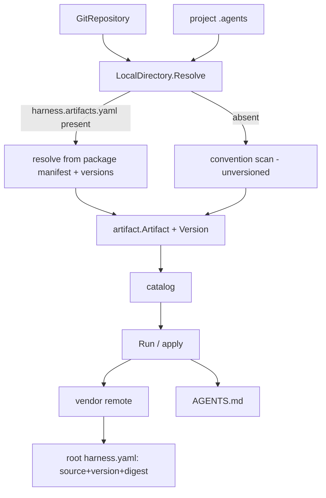

# Source Index and Versioning Design

**Spec**: `.agents/specs/features/source-index-and-versioning/spec.md`
**Status**: Draft

---

## Architecture Overview

A source package manifest (`harness.artifacts.yaml`) at a source's root drives resolution and carries versions; absent, sources fall back to convention scanning. Resolution flows through the existing `Source` port — `LocalDirectory` becomes index-aware, so `GitRepository` (which wraps it over the clone) inherits it for free. Downstream, the project manifest moves to the root and absorbs the retired lock's provenance/integrity, and a new `apply` reconciles a project from that manifest.



---

## Code Reuse Analysis

| Component | Location | How to Use |
| --------- | -------- | ---------- |
| `LocalDirectory` scan (`collect`/`read`) | `internal/source/local.go` | Keep as the convention-fallback path; add an index-driven path beside it. |
| `frontmatter.ParseDocument`/`Validate` | `internal/artifact` | Reuse to load each indexed artifact's entry document. |
| `artifact.Artifact` | `internal/artifact` | Add a `Version` field. |
| `Source` port | `internal/source` | Unchanged signature; `GitRepository` inherits index support via `LocalDirectory`. |
| `workspace.Manifest`/`Apply` | `internal/workspace` | Enrich `Selection`; write at the project root; drop lock writes. |
| `vendor.Vendor` | `internal/vendor` | Reuse; it already returns a content hash → becomes the manifest `digest`. |
| `lock.ContentHash` | `internal/lock` | Keep `ContentHash` (move or re-home); retire the `Lockfile` type and `harness.lock`. |
| `app.materialize`/`Upgrade` | `internal/app` | Record version+digest in the manifest instead of a lockfile; `Upgrade` reads the manifest. |

---

## Components

### Artifacts package manifest

- **Purpose**: A source's root file declaring its artifacts, versions and locations.
- **Location**: parsed in `internal/source/artifactsmanifest.go`; filename `harness.artifacts.yaml`.
- **Interfaces**:
  - `type ArtifactsManifest struct { Artifacts []ArtifactEntry }`
  - `type ArtifactEntry struct { Kind, Name, Version, Path string }`
  - `func LoadArtifactsManifest(path string) (ArtifactsManifest, bool, error)` — bool reports presence.
- **Reuses**: yaml.v3.

### LocalDirectory (index-aware)

- **Purpose**: Resolve from the package manifest when present, else by convention.
- **Location**: `internal/source/local.go`
- **Interfaces**: `Resolve()` unchanged; internally branches on `harness.artifacts.yaml`.
- **Behavior**: index path resolves each entry's `path` to a directory, loads the entry document, validates `frontmatter.name == entry.Name` and the SemVer, rejects path escapes and duplicates as `Issue`s, stamps `Version`. Convention path is today's scan with `Version == ""`.

### SemVer validation

- **Purpose**: Validate a version string.
- **Location**: `internal/artifact/version.go`
- **Interfaces**: `func ValidateVersion(v string) error` (regex: core `MAJOR.MINOR.PATCH` + optional `-prerelease` / `+build`). Equality is plain string comparison; ordering is out of scope.

### Project manifest (root) + retired lock

- **Location**: `internal/workspace/manifest.go`; path via `config.ManifestPath` → project root.
- **Data model** (below). `Apply` writes `harness.yaml` at the root and removes any stale `.agents/harness.yaml` and `harness.lock`.

### apply

- **Purpose**: Reconcile a project from its committed manifest, verifying digests.
- **Location**: `internal/app/apply.go`
- **Interfaces**: `func Apply(out io.Writer) error`.
- **Reuses**: `projectSources`, `vendor`, `lock.ContentHash`, `workspace.RenderAgentsFile`.

---

## Data Models

### `harness.artifacts.yaml` (at a source's root)

```yaml
artifacts:
  - kind: skill
    name: api-designer
    version: 1.3.0
    path: skills/api-designer
  - kind: rule
    name: twelve-factor
    version: 1.0.0
    path: rules/twelve-factor
```

### `harness.yaml` (at the project root) — replaces the old manifest + lock

```go
const manifestVersion = 2

type Manifest struct {
    Version    int         `yaml:"version"`
    Selections []Selection `yaml:"selections"`
}
type Selection struct {
    Kind    artifact.Kind `yaml:"kind"`
    Name    string        `yaml:"name"`
    Source  string        `yaml:"source"`            // origin name: local | home | <remote>
    Version string        `yaml:"version,omitempty"` // semver; empty = unversioned
    Digest  string        `yaml:"digest,omitempty"`  // sha256 of vendored content; empty if referenced
}
```

**Relationships**: one `Selection` per active artifact. `Digest` is present only for vendored remote artifacts (folds in the old `lock.Entry`'s `contentHash`); `Version` mirrors the resolved package version.

---

## Error Handling Strategy

| Scenario | Handling | User impact |
| -------- | -------- | ----------- |
| Malformed `harness.artifacts.yaml` | typed error naming the file | "invalid artifacts manifest <path>: …" |
| Invalid SemVer in an entry | `Issue`, entry skipped | existing "⚠ N skipped" diagnostics |
| `path` missing / escapes repo / name mismatch | `Issue`, entry skipped | same diagnostics |
| Duplicate kind+name in index | `Issue` on the later entry | same diagnostics |
| Digest drift on `apply` | reported, not silently overwritten | "X drifted from its recorded digest" |
| Stale `harness.lock` present | removed on save/apply | silent cleanup |

---

## Tech Decisions

| Decision | Choice | Rationale |
| -------- | ------ | --------- |
| Where version lives | The package manifest (index) / `package.json` for npm — not the frontmatter | One source of truth per package; mirrors `package.json`; avoids index/frontmatter disagreement. |
| Index optional | Convention fallback when absent | Consume any agentskills repo unchanged; index unlocks versioning + free layout. |
| Index awareness home | `LocalDirectory` | `GitRepository` inherits it via delegation; one implementation. |
| SemVer scope | Validate + equality only | Ranges/ordering need a registry (deferred). |
| Manifest vs lock | One root manifest carrying version+digest | Without ranges, intent==resolution; the split is unjustified (see STATE D9). |
| `ContentHash` reuse | Keep the function, drop `Lockfile` | Hashing is still needed for `digest`; the lockfile is not. |

---

## Migration

Pre-release: no real project manifests exist yet. `config.ManifestPath` simply changes to the project root and `LockPath` usage is removed; `Apply` best-effort-removes a stale `.agents/harness.yaml` / `harness.lock`. No data migration tooling needed.
