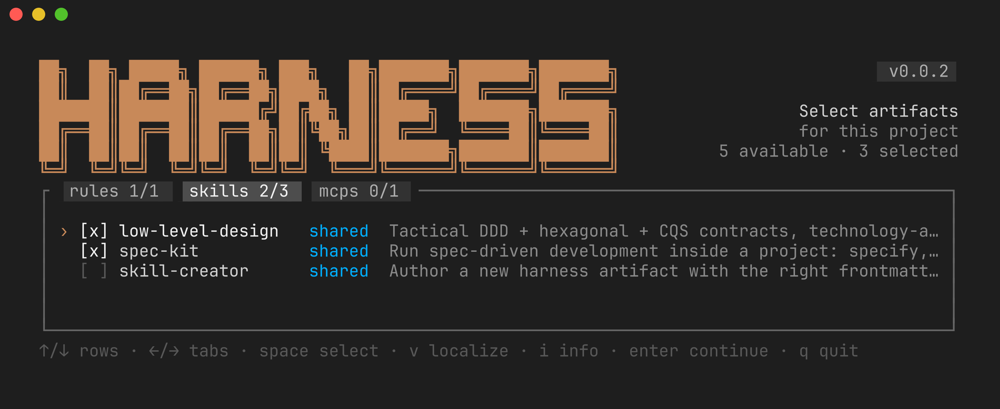

# harness

**harness is a command-line tool (CLI)** for configuring AI-agent artifacts —
**rules**, **skills**, **agents** and **MCP setups** — across your projects from a
single shared library, generating the `AGENTS.md` that tells agents *what to
always load* and *what to load only when needed*.

<div align="center">

[](https://github.com/devstationtech/harness/actions/workflows/ci.yml)
[](https://github.com/devstationtech/harness/releases/latest)
[](https://goreportcard.com/report/github.com/devstationtech/harness)
[](LICENSE)
[](CONTRIBUTING.md)

[](https://go.dev)
[](https://github.com/charmbracelet/bubbletea)
[](https://agents.md)
[](https://modelcontextprotocol.io)
[](#install)

</div>



`harness` merges a personal library in your home (`~/.harness`) with the
project-local artifacts in `.agents/`, lets you pick what each project needs in a
small TUI, composes technology-agnostic skills with stack-specific
implementations, and writes a portable `AGENTS.md` + a `harness.yaml` manifest.

> **Status:** early pilot (`v0.x`). Single-user / local sharing between your own
> projects, with optional git artifact sources. APIs and the CLI may still change.

## Install

| Platform | Command |
| --- | --- |
| Linux / macOS | `curl -fsSL https://raw.githubusercontent.com/devstationtech/harness/main/install.sh \| sh` |
| Windows (PowerShell) | `irm https://raw.githubusercontent.com/devstationtech/harness/main/install.ps1 \| iex` |
| Go toolchain | `go install github.com/devstationtech/harness@latest` |
| From source | `git clone … && cd harness && make install` |

The `curl`/`irm` installers download a prebuilt release binary (override the
target with `HARNESS_INSTALL_DIR`, pin a version with `HARNESS_VERSION=v0.1.0`).
See [docs/RELEASING.md](docs/RELEASING.md) for details — including installing
while the repository is still private.

**Updating.** harness checks GitHub for newer releases: the selection screen
shows an *update available* hint in its bottom-left footer — press `u` to update
and relaunch in place — or run `harness self-update` anytime. Set
`HARNESS_NO_UPDATE_CHECK=1` to silence the check.

## Quick start

```sh
harness init     # create & seed your shared library (~/.harness)
cd my-project
harness          # pick artifacts for this project (interactive)
```

Saving writes two files at the project root:

- **`AGENTS.md`** — the agent entry point: a loading protocol plus one table per
  kind, a "composed designs" section, and an "MCP servers" section. Commit it.
- **`harness.yaml`** — the manifest of active artifacts (source of truth). Commit
  it; `harness apply` reconstructs the project from it on a fresh clone.

## How it works

Four artifact kinds share one on-disk convention (adapted from
[Agent Skills](https://agentskills.io)):

| Kind  | Container | Entry file | Role in `AGENTS.md` |
| ----- | --------- | ---------- | ------------------- |
| rule  | `rules/`  | `RULE.md`  | Invariant — **load ALWAYS** |
| skill | `skills/` | `SKILL.md` | Capability — **load on NEED** |
| agent | `agents/` | `AGENT.md` | Executor — **delegate on NEED** |
| mcp   | `mcps/`   | `MCP.md`   | How to set up & use an MCP server — **on request** |

An `mcp` artifact is **not** an MCP server. Its `MCP.md` (plus deterministic
setup scripts) is guidance the agent reads to *configure and use* an MCP server
for the tool(s) you enable — acted on only when you ask, never loaded as context.

Artifacts resolve across three locations by **precedence** — project `.agents/`
(`local`) overrides `~/.harness/` (`shared`) overrides configured git sources.
Shared artifacts are **referenced in place**, not copied, so an empty `.agents/`
never clutters a project; **localize** one (TUI `v`, or `harness vendor`) to copy
it in and make the project self-contained.

**Composition** lets an abstract artifact (declaring `contracts`) be fulfilled by
specific capabilities (`implements` / `provides` / `stack`) through explicit
per-contract bindings made in the compose wizard. A contract binds one capability
by default, or several when the abstract sets `multiple: true` (e.g. an MCP
enabled for several agents at once).

Full model — precedence, manifest schema, composition, localization, sources —
is in **[docs/concepts.md](docs/concepts.md)**.

## Commands

```
harness            Select artifacts for the current project (interactive)
harness init       Create and seed the shared library (~/.harness)
harness list       List the merged catalog as plain text
harness source …   Manage artifact sources (add | list | remove)
harness update     Refresh all sources and rebuild the search index
harness search Q   Search artifacts across all sources (offline)
harness upgrade    Re-resolve this project's selections to the latest
harness apply      Reconcile this project from its committed harness.yaml
harness vendor K/N Copy a shared/remote artifact into .agents (local override)
harness self-update Update harness to the latest GitHub release
harness version    Print the version
```

Selection-TUI keys and the full per-command reference are in
**[docs/cli.md](docs/cli.md)**.

## Configuration

- `HARNESS_HOME` — override the shared-library location (default `~/.harness`).

## Development

Common tasks are wrapped in the `Makefile` (run `make` to list them); `make
check` is the full gate (gofmt · vet · lint · test) and mirrors CI. See
**[CONTRIBUTING.md](CONTRIBUTING.md)** to get set up, and
**[docs/RELEASING.md](docs/RELEASING.md)** to cut a release.

## License

[MIT](LICENSE) © DevStation.
